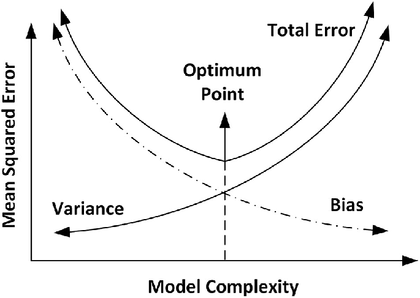

## Risque quadratique ponctuel des estimateurs à noyau sur les classe des espaces de Hölder
   
  Nous nous intéressons au risque quadratique ponctuel de $\hat{f}_n$, i.e étant donné\newline
  $x_0 \in \mathbb{R}$ 

$$
R(\hat {f}_n, f) = \mathbb{E}[|\hat {f}_n(x_0) - f(x_0)|^2]
$$

 Rappelons la décomposition "biais au carré-variance" du risque quadratique:
  
$$
  \mathbb{E}[|\hat {f}_n(x_0) - f(x_0)|^2] = (\mathbb{E}[\hat {f}_n(x_0)] - f(x_0))^2 + \mathbb{V}(\hat {f}_n(x_0))
$$

  
### Majoration du biais et de la variance

  Dans cette section, nous allons nous intéresser au compromis biais-variance afin de minimiser le risque quadratique.
Les deux propositions suivantes montrent que sous certaines hypothèses, on peut majorer le biais ainsi que la variance.\newline

\begin{dfn} : Soit $l \in \mathbb{N^*}$. On dit que le noyau $K$ est d'ordre $l$ si $u^jK(u)$ est intégrable et $\int u^jK(u)du = 0$, $j = {1,...,l}$.\newline
\end{dfn}

\begin{prop}: Si $f \in \sum(\beta,L)$ avec $\beta > 0$ et $L > 0$ et si $K$ est un noyau d'ordre $l = \left\lfloor{\beta}\right\rfloor$ tel que $\int |{u}^{\beta}|\,.|{K(u)}|~du < \infty$ alors pour tout $x_0 \in \mathbb{R}$, et pour tout $h>0$ le biais peut être borné comme suit:

$$
|\mathbb{E}[\hat{f}_n(x_0)] - f(x_0)|\leqslant \frac{h^{\beta}L}{l!}\int|u|^{\beta}|K(u)|du
$$
\end{prop}
  
\begin{demo}: (voir Esti-non para.pdf page 97, prop 4.10).\newline

   Le biais au carré tend vers zéro à la vitesse $h^{2\beta}$. Plus la fonction $f$ est régulière, plus le biais tend vite vers zéro quand $h$ tend vers zéro (à condition bien sûr que l'ordre du noyau soit suffisamment grand).\newline
\end{demo} 
\begin{prop}: Si $f$ est bornée et si $K$ est de carré intégrable alors 

$$
\mathbb{V}(\hat {f}_n(x_0)) \leqslant \frac{\begin{Vmatrix}f\end{Vmatrix}_{\infty}\begin{Vmatrix}K\end{Vmatrix}^2_2}{nh}
$$

En particulier, si $f \in \sum(\beta,L)$ alors
$$
\mathbb{V}(\hat{f}_n(x_0))\leqslant\frac{M(\beta, L)}{nh}
$$
\end{prop}
\begin{demo}:

$$
\begin{aligned}
\mathbb{V}(\hat {f}_n(x_0)) &= \mathbb{V}(\frac{1}{nh}\sum_{i=1}^nK(\frac{X_i-x_0}{h})) \\
&=\sum_{i=1}^n\mathbb{V}(\frac{1}{nh}K(\frac{X_i-x_0}{h})) \\
&=\sum_{i=1}^n\mathbb{V}(\frac{1}{nh}K(\frac{X_i-x_0}{h}))  \\           &=\sum_{i=1}^n\frac{1}{n^2h^2}\mathbb{V}(K(\frac{X_i-x_0}{h})) \\
&=\frac{1}{nh^2}\mathbb{V}(K(\frac{X_1-x_0}{h}) \\
&\leqslant \frac{1}{nh^2}\mathbb{E}(K^2(\frac{X_1-x_0}{h})) \\
&=\frac{1}{nh^2}\int K^2(\frac{u-x_0}{h}f(u)du \\
&=\frac{1}{nh}\int K^2(v)f(x_0 +vh)dv
\end{aligned}
$$ 

Et enfin,on admet le résultat suivant : \newline
il existe une constante positive $M(\beta,L)$ tel que $\begin{Vmatrix}f\end{Vmatrix}_{\infty} \leqslant M(\beta, L)$. Ceci implique que :

$$
 \mathbb{V}(\hat {f}_n(x_0))\leqslant\frac{1}{nh}M(\beta, L)\int K^2(v)dv 
$$ 
 \end{demo}
 
 Pour que la variance tende vers zéro, il faut que $nh$ tende vers l'infini. En particulier, à $n$ fixé, la variance est une fonction décroissante de $h$. Il y a donc une valeur optimale de $h$ qui doit réaliser l'équilibre entre le biais au carrré et la variance. On peut à présent donner un contrôle du risque quadratique par le théorême suivant.
 
\begin{thm} Soit $\beta>0$ et $L>0$ et $K$ un noyau de carré intégrable et d'ordre $\left\lfloor{\beta}\right\rfloor$ tel que $\int |u^{\beta}|\,.|K(u)|du<\infty$. Alors, en choissant une fenêtre de la forme $h=cn^{-\frac{1}{2\beta+1}}$ avec une constante $c>0$, on obtient pour tout $x_0 \in \mathbb{R}$,

$$ 
R(\hat {f}_n(x_0)),\sum_d(\beta, L)):= \underset{f\in\sum_d(\beta,L)}{sup}\mathbb{E}[|\hat {f}_n(x_0)-f(x_0)|^2]\leqslant Cn^{-\frac{2\beta}{2\beta+1}}
$$ 
 où $C$ est une constante dépendant de $L,~\beta,~ c$ et $K$.
 \end{thm}
\begin{demo}: 
  On a :
$$
 R(\hat {f}_n(x_0),f(x_0))= \text{Biais + Variance}
$$ 

   Si nous nous référons aux deux propositions précédentes, nous pouvons écrire :

$$
 R(\hat {f}_n(x_0),f(x_0))\leqslant(\frac{h^{\beta}L}{l!}\int |u|^{\beta}|K(u)|du)^2 + \frac{M(\beta,L)\begin{Vmatrix}K\end{Vmatrix}_2^2}{nh}
$$

On cherche ensuite la fenêtre $h$ qui minimise cette quantité. Comme on ne se soucie pas vraiment des constantes exactes quand on cherche la vitesse de convergence d'un estimateur, on utilisera la notation $c_1=(\frac{L}{l!}\int |u|^{\beta}|K(u)|du)^2$ et $c_2=\frac{M(\beta,L)\begin{Vmatrix}K\end{Vmatrix}_2^2}{nh}$. On doit alors minimiser en $h$ la quantité :

$$
  c_1h^{2\beta}+\frac{c_2}{nh}
$$

On a une quantité croissante et une quantité décroissante en $h$. Encore une fois, comme on ne se soucie pas pas des constantes, donc on cherche la fenêtre $h$ qui nous donne l'ordre minimal du risque. Quand $h$ est trop grand, le biais est trop grand, et quand $h$ est trop petit, c'est la variance qui est trop grande. On cherche donc la fenêtre $h$ qui réalise un équilibre entre le biais au carré et la variance:

$$ 
  h^{2\beta}\approx\frac{1}{nh}
$$
où le signe $\approx$ signifie ici "de l'ordre de". Cela donne :

$$
  h\approx n^{-\frac{1}{2\beta +1}}
$$

Autrement dit, pour une fenêtre $h$ de l'odre de $n^{-\frac{1}{2\beta+1}}$, le biais au carré et la variance sont de même ordre.Plus exactement, on choisit la fenêtre $h_*=cn^{-\frac{1}{2\beta+1}}$, avec $c$ une constante positive, on a :

$$
  Biais\ au\ carré \approx h_{*}^{2\beta}\approx Variance\approx \frac{1}{nh_{*}}
$$

De plus, on a alors :
$$
  h_* \approx n^{-\frac{2\beta}{2\beta + 1}}
$$

 
Autrement dit, il existe une certaine constante $C$ telle que, pour cette fenêtre $h_*$, on a :

$$
  R(\hat {f}_n(x_0),\sum_d(\beta,L))\leqslant Cn^{\frac{-2\beta}{2\beta + 1}}
$$

  Cette fenêtre est donc optimale à une constante près (si on change $c$, on change $C$ ça ne change pas le taux qui est $n^{\frac{-2\beta}{2\beta+1}}$).\newline
\end{demo}
\begin{rem}:  
  * L'estimatimateur dépend de $\beta$ à travers la fenêtre $h$. Or, sans   connaissance a priori sur les propriétés de la fonction $f$, on ne peut donc pas utiliser cet estimateur. On essaie alors de trouver un choix de fenêtre ne dépendant que des données et qui soit aussi performant (ou presque) que l'estimateur utilisant cette fenêtre optimale. A ce sujet, on introduira plus loin un choix de fenêtr ne dépendant que des données et qui est basé sur ce qu'on appelle la validation croisée (ou "cross validation" en Anglais).  
  * Nous avons vu plus haut que le biais au carré tend vers zéro quand $h$ tend vers zéro (si $\beta$ est suffisamment grand). Nous en déduisons la convergence de l'espérance de l'estimateur à noyau $\hat {f}_n$ vers la fonction $f$. Et donc, l'estimateur à noyau est asymptotiquement sans biais, $\hat {f}_n$ est consistante.\newline
\end{rem}

\begin{prop}

Dans le cas d'un estimateur à noyau, on a :\newline
$$
R(\hat{f},f)=\mathbb E_f[\parallel\hat{f}-f\parallel^2 ] = \parallel f-K_h*f \parallel^2 + \mathbb E_f[\parallel\hat{f}-K_h*f \parallel^2]
$$
\end{prop}

\begin{demo}
On que :\newline 

$\mathbb E_f\parallel\hat{f}-f \parallel^2 = \mathbb {E}_f[\parallel\hat{f}+\mathbb {E}_f(\hat{f} )-(\mathbb {E}_f(\hat{f} )-f)\parallel ]^2$.\newline

$\mathbb E_f[\parallel\hat{f}-f \parallel]^2 = \mathbb {E}_f[\parallel\hat{f}+\mathbb E_f(\hat{f} )\parallel]^2 +\mathbb {E}_f[\parallel\mathbb {E}_f(\hat{f} )-f\parallel] ^2 - 2~\mathbb {E}_f[<\hat{f}-\mathbb {E}_f(\hat{f});\mathbb {E}_f(\hat{f})-f>]$.\newline

Comme $\hat{f}$ est déterministe\newline 
$2~\mathbb {E}_f(<\hat{f}-\mathbb E_f(\hat{f})~;~\mathbb {E}_f(\hat{f})-f>)=2<0,~\mathbb E_f(\hat{f})-f>=0$\newline
Ainsi $\parallel\mathbb {E}_f(\hat{f} )-f\parallel$ est déterministe\newline
On obtient :\newline
$R(\hat{f},f)=\mathbb {E}_f[\parallel\hat{f}-f\parallel^2 ] = \parallel f-K_h*f \parallel^2 + \mathbb {E}_f[\parallel\hat{f}-K_h*f\parallel^2]$ 
\end{demo}

On a bien trouvé que : 
$$R(\hat{f},f)=biais^2+\mathbb Var$$

\begin{rem}\
   Plus la  valeur de h est grande, plus le biais devient grand et la variance petite et de même ;  
   plus la valeur de h est petite plus le biais devient petit et la variance explose.\newline
\end{rem}
 
Donc, afin de minimiser l'expression du risque le choix de h est très influent et même plus crucial pour la qualité de l'estimateur que celui de la noyau $K$.\newline
On doit chercher le meilleur compromis biais-variance pour avoir un risque minimal.\newline
Un paramètre trop faible provoque l'apparition de détails artificiels sur le graph de l'estimateur (La variance devient trop grande), par contre si on prend une valeur de h très grande on aura la majorité des caractéristiques effacées.\newline

\hspace*{4cm} {width="310"}

(http://chimix.com/an16/pol16/image/aspts35.jpg)

